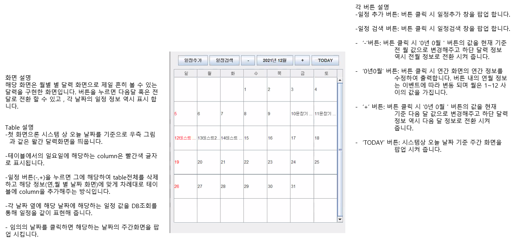

# 금연 다이어리 프로그램

## 프로젝트 소개

제 첫번째 프로젝트로 ‘객체지향언어’ 전공 과목의 과제로 5 명의 조원과 함께한 프로젝트 입니다. 프로그램 관련해서는 일반적인 다이어리에 Todo 리스트와 금연을 위한 금연타이머 기능을 추가하였으며 HTML , CSS , JavaScript 등의 화면 구현 관련 기술을 사용하지 않았으며 외부 라이브러리나 FrameWork 없이 JAVA 언어 위주로 접근 한 프로젝트 입니다.

---

## 프로젝트 기능

프로그램의 주요 기능들은 다음과 같으며 저는 이중 ‘**캘린더 기능**’을 담당 하였습니다.

- 캘린더 기능
:  일정에 관한 Data를 캘린더 화면을 통해 한눈에 확인
- Todo 리스트 기능
:  중요한 일정을 따로 관리 및 표현
- 금연 타이머 기능
:  금연 성취도를 표현하기 위해 타이머 형식으로 표현.

---

## 담당화면(기능) 소개

제가 담당 한 기능의 파일은 `todolist_diary/MonthCal.java` 이고  JPanel의 테이블을 이용하여 흔히 볼수 있는 달력화면과 더불어 일정을 DB에서 조회하여 달력에 표현 해주었습니다.
다음은 화면 UX에 관한 간단한 설명입니다.

---